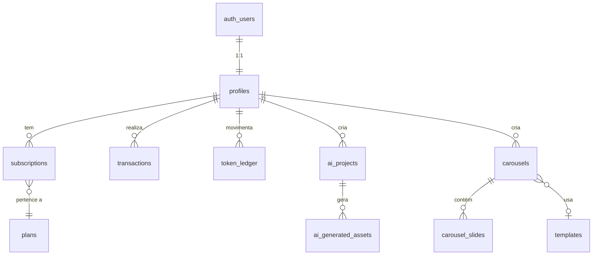

# Modelagem de Dados - InfHub (Supabase / PostgreSQL)

Este documento define toda a estrutura do banco de dados do InfHub, hospedado no **Supabase** (PostgreSQL). Inclui tabelas, enums, relacionamentos, políticas RLS e buckets de Storage.

---

## 📐 Diagrama de Relacionamentos (ERD)



---

## 🏷️ Enums (Tipos Customizados)

```sql
-- Status da assinatura do usuário
CREATE TYPE subscription_status AS ENUM (
  'active',       -- Pagamento em dia
  'past_due',     -- Pagamento atrasado (período de carência)
  'canceled',     -- Cancelou voluntariamente
  'inactive'      -- Nunca assinou ou expirou
);

-- Tipo de transação financeira
CREATE TYPE transaction_type AS ENUM (
  'subscription_payment',   -- Pagamento recorrente da assinatura
  'one_time_purchase',      -- Compra avulsa de pacote de tokens
  'ai_package_purchase'     -- Compra avulsa específica do Produto 1 (IA)
);

-- Status do pagamento (espelhando Mercado Pago)
CREATE TYPE payment_status AS ENUM (
  'pending',    -- Aguardando confirmação
  'approved',   -- Pagamento aprovado
  'rejected',   -- Pagamento recusado
  'refunded'    -- Estorno realizado
);

-- Tipo de movimentação no saldo de tokens
CREATE TYPE ledger_type AS ENUM (
  'credit',   -- Entrada de tokens (compra, assinatura, bônus)
  'debit'     -- Saída de tokens (uso de serviço)
);

-- Origem da movimentação de tokens
CREATE TYPE ledger_source AS ENUM (
  'subscription',       -- Crédito mensal da assinatura
  'purchase',           -- Compra avulsa
  'ai_project',         -- Débito por geração de IA
  'carousel_export',    -- Débito por exportação de carrossel
  'bonus',              -- Crédito promocional/bônus
  'refund'              -- Estorno de tokens
);

-- Status de um projeto de IA
CREATE TYPE ai_project_status AS ENUM (
  'pending',       -- Aguardando processamento
  'processing',    -- IA está gerando
  'completed',     -- Geração concluída com sucesso
  'failed'         -- Falha na geração
);

-- Tipo de asset gerado pela IA
CREATE TYPE ai_asset_type AS ENUM (
  'image',
  'video'
);

-- Formato do post (carrossel)
CREATE TYPE post_format AS ENUM (
  'carousel',   -- 4:5 (1080x1350px)
  'square',     -- 1:1 (1080x1080px)
  'stories'     -- 9:16 (1080x1920px)
);

-- Layout de posicionamento do conteúdo no slide
CREATE TYPE content_layout AS ENUM (
  'top_left',     'top_center',     'top_right',
  'middle_left',  'middle_center',  'middle_right',
  'bottom_left',  'bottom_center',  'bottom_right'
);

-- Modo de imagem no carrossel
CREATE TYPE image_mode AS ENUM (
  'none',              -- Sem imagens
  'background',        -- Imagem de fundo
  'grid',              -- Grade de imagens
  'interleaved'        -- Intercalar ambas
);

-- Layout de thumbnails (template Profile/Twitter)
CREATE TYPE thumbnail_layout AS ENUM (
  'none',              -- Sem thumbnail
  'one_landscape',     -- 1 thumbnail 16:9
  'one_square',        -- 1 quadrada
  'two_vertical',      -- 2 verticais
  'four_grid'          -- 4 quadradas (2x2)
);

-- Posição de imagens relativa ao texto
CREATE TYPE image_position AS ENUM (
  'above_header',
  'below_header',
  'after_first_paragraph',
  'below_text'
);

-- Modo de enquadramento da imagem
CREATE TYPE image_fit AS ENUM (
  'cover',     -- Preencher (corta para cobrir)
  'contain'    -- Inteira (mostra tudo, pode ter bordas)
);

-- Estilo de sobreposição/sombra na imagem
CREATE TYPE overlay_style AS ENUM (
  'none',
  'base_strong',       -- Escurece a base
  'base_soft',         -- Escurece suavemente a base
  'full_dark',         -- Escurece o slide inteiro
  'full_soft'          -- Leve escurecimento geral
);
```

---

## 📊 Tabelas

### 1. `profiles` — Perfil do Usuário

Estende `auth.users` do Supabase Auth. Criada automaticamente via trigger `on_auth_user_created`.

```sql
CREATE TABLE public.profiles (
  id              UUID PRIMARY KEY REFERENCES auth.users(id) ON DELETE CASCADE,
  full_name       TEXT,
  avatar_url      TEXT,                            -- URL no Supabase Storage
  instagram_handle TEXT,                           -- @handle padrão para os carrosséis
  token_balance   INTEGER NOT NULL DEFAULT 0,      -- Saldo atual de tokens
  created_at      TIMESTAMPTZ NOT NULL DEFAULT now(),
  updated_at      TIMESTAMPTZ NOT NULL DEFAULT now()
);

-- Trigger para criar profile automaticamente no signup
CREATE OR REPLACE FUNCTION public.handle_new_user()
RETURNS TRIGGER AS $$
BEGIN
  INSERT INTO public.profiles (id, full_name, avatar_url)
  VALUES (
    NEW.id,
    NEW.raw_user_meta_data ->> 'full_name',
    NEW.raw_user_meta_data ->> 'avatar_url'
  );
  RETURN NEW;
END;
$$ LANGUAGE plpgsql SECURITY DEFINER;

CREATE TRIGGER on_auth_user_created
  AFTER INSERT ON auth.users
  FOR EACH ROW EXECUTE FUNCTION public.handle_new_user();
```

---

### 2. `plans` — Planos de Assinatura

Tabela de configuração (gerenciada pelo admin). Define os planos disponíveis.

```sql
CREATE TABLE public.plans (
  id              UUID PRIMARY KEY DEFAULT gen_random_uuid(),
  name            TEXT NOT NULL,                   -- Ex: "Starter", "Pro", "Business"
  description     TEXT,
  price_brl       NUMERIC(10,2) NOT NULL,          -- Valor mensal em R$
  tokens_per_month INTEGER NOT NULL,               -- Quantidade de tokens creditados/mês
  is_active       BOOLEAN NOT NULL DEFAULT true,   -- Plano disponível para venda?
  features        JSONB DEFAULT '[]',              -- Lista de features para exibir na UI
  created_at      TIMESTAMPTZ NOT NULL DEFAULT now(),
  updated_at      TIMESTAMPTZ NOT NULL DEFAULT now()
);
```

---

### 3. `subscriptions` — Assinaturas Ativas

Controla o vínculo entre o usuário e o plano contratado via Mercado Pago.

```sql
CREATE TABLE public.subscriptions (
  id                    UUID PRIMARY KEY DEFAULT gen_random_uuid(),
  user_id               UUID NOT NULL REFERENCES public.profiles(id) ON DELETE CASCADE,
  plan_id               UUID NOT NULL REFERENCES public.plans(id),
  status                subscription_status NOT NULL DEFAULT 'inactive',
  mp_subscription_id    TEXT,                       -- ID da assinatura no Mercado Pago
  mp_payer_id           TEXT,                       -- ID do pagador no Mercado Pago
  current_period_start  TIMESTAMPTZ,                -- Início do ciclo atual
  current_period_end    TIMESTAMPTZ,                -- Fim do ciclo atual
  canceled_at           TIMESTAMPTZ,                -- Quando cancelou (se cancelou)
  created_at            TIMESTAMPTZ NOT NULL DEFAULT now(),
  updated_at            TIMESTAMPTZ NOT NULL DEFAULT now()
);

CREATE INDEX idx_subscriptions_user ON public.subscriptions(user_id);
CREATE INDEX idx_subscriptions_mp ON public.subscriptions(mp_subscription_id);
```

---

### 4. `transactions` — Histórico Financeiro

Cada pagamento processado pelo Mercado Pago (assinatura ou compra avulsa).

```sql
CREATE TABLE public.transactions (
  id              UUID PRIMARY KEY DEFAULT gen_random_uuid(),
  user_id         UUID NOT NULL REFERENCES public.profiles(id) ON DELETE CASCADE,
  type            transaction_type NOT NULL,
  status          payment_status NOT NULL DEFAULT 'pending',
  amount_brl      NUMERIC(10,2) NOT NULL,          -- Valor pago em R$
  tokens_granted  INTEGER NOT NULL DEFAULT 0,      -- Tokens a creditar quando approved
  mp_payment_id   TEXT,                             -- ID do pagamento no Mercado Pago
  mp_merchant_order_id TEXT,                        -- ID da ordem no Mercado Pago
  metadata        JSONB DEFAULT '{}',              -- Dados extras do webhook
  created_at      TIMESTAMPTZ NOT NULL DEFAULT now()
);

CREATE INDEX idx_transactions_user ON public.transactions(user_id);
CREATE INDEX idx_transactions_mp ON public.transactions(mp_payment_id);
```

---

### 5. `token_ledger` — Livro Razão de Tokens

Registro imutável de todas as movimentações de tokens. O `token_balance` em `profiles` é um cache; esta tabela é a fonte da verdade.

```sql
CREATE TABLE public.token_ledger (
  id              UUID PRIMARY KEY DEFAULT gen_random_uuid(),
  user_id         UUID NOT NULL REFERENCES public.profiles(id) ON DELETE CASCADE,
  type            ledger_type NOT NULL,             -- credit ou debit
  amount          INTEGER NOT NULL,                 -- Sempre positivo
  source          ledger_source NOT NULL,            -- De onde veio a movimentação
  reference_id    UUID,                              -- ID da transação, ai_project ou carousel
  balance_after   INTEGER NOT NULL,                  -- Saldo resultante após esta operação
  description     TEXT,                              -- Ex: "Crédito mensal - Plano Pro"
  created_at      TIMESTAMPTZ NOT NULL DEFAULT now()
);

CREATE INDEX idx_ledger_user ON public.token_ledger(user_id);
CREATE INDEX idx_ledger_created ON public.token_ledger(created_at DESC);
```

---

### 6. `templates` — Templates de Carrossel

Templates pré-construídos pelo admin (Minimalista, Profile, TechViral, Creators, etc.).

```sql
CREATE TABLE public.templates (
  id              UUID PRIMARY KEY DEFAULT gen_random_uuid(),
  name            TEXT NOT NULL,                    -- Ex: "Minimalista", "TechViral"
  slug            TEXT NOT NULL UNIQUE,             -- Ex: "minimalista", "techviral"
  description     TEXT,                             -- Descrição estratégica para a galeria
  category        TEXT,                             -- Ex: "Mais popular", "Novo"
  preview_url     TEXT,                             -- Imagem de preview no Storage
  default_styles  JSONB NOT NULL DEFAULT '{}',      -- Estilos padrão do template (cores, fontes, overlay)
  slide_schema    JSONB NOT NULL DEFAULT '[]',      -- Estrutura padrão dos slides (capa, conteúdo, CTA)
  is_active       BOOLEAN NOT NULL DEFAULT true,
  sort_order      INTEGER NOT NULL DEFAULT 0,
  created_at      TIMESTAMPTZ NOT NULL DEFAULT now(),
  updated_at      TIMESTAMPTZ NOT NULL DEFAULT now()
);
```

---

### 7. `carousels` — Projetos de Carrossel

Cada carrossel criado por um usuário (manualmente ou via IA).

```sql
CREATE TABLE public.carousels (
  id              UUID PRIMARY KEY DEFAULT gen_random_uuid(),
  user_id         UUID NOT NULL REFERENCES public.profiles(id) ON DELETE CASCADE,
  template_id     UUID REFERENCES public.templates(id) ON DELETE SET NULL,
  title           TEXT NOT NULL DEFAULT 'Sem título',
  format          post_format NOT NULL DEFAULT 'carousel',
  
  -- Configurações globais do carrossel
  global_styles   JSONB NOT NULL DEFAULT '{}',
  /*  Estrutura esperada de global_styles:
      {
        "accent_color": "#FE2C55",
        "gradient": { "from": "#25F4EE", "to": "#FE2C55", "direction": "to-r" },
        "font_heading": "Outfit",
        "font_body": "Inter",
        "overlay": { "style": "base_strong", "opacity": 90 }
      }
  */
  
  -- Configurações dos cantos (watermarks globais)
  corners         JSONB NOT NULL DEFAULT '{}',
  /*  Estrutura esperada de corners:
      {
        "top_left":     { "text": "@seuperfil", "enabled": true },
        "top_right":    { "text": "IA Pós-Mito", "enabled": true },
        "bottom_left":  { "text": "O Futuro da Anthropic", "enabled": true },
        "bottom_right": { "text": "arrasta", "enabled": true, "icon": "arrow_right" },
        "show_corners": true,
        "show_indicators": true,
        "font_size": 20,
        "border_distance": 80,
        "text_opacity": 90
      }
  */
  
  -- Parâmetros usados na geração com IA (se aplicável)
  ai_generation   JSONB DEFAULT NULL,
  /*  Estrutura esperada de ai_generation:
      {
        "prompt": "Claude Fable 5: Anthropic libera IA do Mythos",
        "exact_content": false,
        "language": "pt-BR",
        "slide_count": 5,
        "image_mode": "background",
        "generate_images": true,
        "image_style_prompt": "Fotografia editorial, tons neutros...",
        "reference_image_urls": []
      }
  */

  tokens_cost     INTEGER NOT NULL DEFAULT 0,
  is_exported     BOOLEAN NOT NULL DEFAULT false,
  created_at      TIMESTAMPTZ NOT NULL DEFAULT now(),
  updated_at      TIMESTAMPTZ NOT NULL DEFAULT now()
);

CREATE INDEX idx_carousels_user ON public.carousels(user_id);
CREATE INDEX idx_carousels_updated ON public.carousels(updated_at DESC);
```

---

### 8. `carousel_slides` — Slides Individuais

Cada tela dentro de um carrossel, com conteúdo e estilos por slide.

```sql
CREATE TABLE public.carousel_slides (
  id                UUID PRIMARY KEY DEFAULT gen_random_uuid(),
  carousel_id       UUID NOT NULL REFERENCES public.carousels(id) ON DELETE CASCADE,
  position_index    INTEGER NOT NULL,                -- Ordem do slide (0, 1, 2...)

  -- Conteúdo textual
  slide_title       TEXT,
  slide_subtitle    TEXT,
  body_text         TEXT,                            -- Texto corrido / parágrafos
  tag_label         TEXT,                            -- Pílula de categoria (ex: "OTIMIZAÇÃO DE TEMPO")
  cta_text          TEXT,                            -- Texto do botão de ação
  highlighted_words TEXT[],                          -- Palavras com marca-texto (highlight)

  -- Layout e posicionamento
  content_layout    content_layout NOT NULL DEFAULT 'bottom_left',
  glass_effect      BOOLEAN NOT NULL DEFAULT false,  -- Glassmorphism ao redor do conteúdo
  padding_h         INTEGER NOT NULL DEFAULT 170,    -- Margem horizontal (px)
  padding_v         INTEGER NOT NULL DEFAULT 230,    -- Margem vertical (px)

  -- Imagem de fundo
  background_image_url TEXT,                         -- Caminho no Supabase Storage
  image_fit         image_fit DEFAULT 'cover',
  image_position_x  INTEGER DEFAULT 50,              -- Panorâmica X (0-100)
  image_position_y  INTEGER DEFAULT 50,              -- Panorâmica Y (0-100)
  image_zoom        INTEGER DEFAULT 100,             -- Zoom % (100 = original)
  image_flip_h      BOOLEAN DEFAULT false,           -- Espelhar horizontalmente
  image_opacity     INTEGER DEFAULT 100,             -- Opacidade da imagem (0-100)
  
  -- Sobreposição / Sombra
  overlay_style     overlay_style DEFAULT 'none',
  overlay_opacity   INTEGER DEFAULT 90,

  -- Layout de thumbnails (para templates tipo Profile/Twitter)
  thumbnail_layout  thumbnail_layout DEFAULT 'none',
  image_position    image_position DEFAULT 'below_text',
  thumbnail_urls    TEXT[] DEFAULT '{}',              -- Array de URLs das thumbnails

  -- Estilos específicos deste slide (sobrescreve global_styles do carrossel)
  custom_styles     JSONB DEFAULT '{}',

  created_at        TIMESTAMPTZ NOT NULL DEFAULT now(),
  updated_at        TIMESTAMPTZ NOT NULL DEFAULT now(),

  UNIQUE(carousel_id, position_index)
);

CREATE INDEX idx_slides_carousel ON public.carousel_slides(carousel_id);
```

---

### 9. `ai_projects` — Projetos de IA (Produto 1 — TikTok Shop)

Requisição de geração de imagens e vídeo para vendas.

```sql
CREATE TABLE public.ai_projects (
  id                  UUID PRIMARY KEY DEFAULT gen_random_uuid(),
  user_id             UUID NOT NULL REFERENCES public.profiles(id) ON DELETE CASCADE,
  status              ai_project_status NOT NULL DEFAULT 'pending',
  tokens_cost         INTEGER NOT NULL DEFAULT 0,

  -- Inputs do usuário
  product_image_url   TEXT NOT NULL,                 -- Foto do produto (Storage)
  model_image_url     TEXT,                          -- Foto do modelo/pessoa (Storage, null se modelo padrão)
  selected_model_id   TEXT,                          -- ID de um modelo pré-existente do sistema
  prompt              TEXT,                          -- Instruções extras para a IA
  
  -- Metadados de processamento
  error_message       TEXT,                          -- Mensagem de erro em caso de falha
  processing_started_at TIMESTAMPTZ,
  processing_finished_at TIMESTAMPTZ,

  created_at          TIMESTAMPTZ NOT NULL DEFAULT now(),
  updated_at          TIMESTAMPTZ NOT NULL DEFAULT now()
);

CREATE INDEX idx_ai_projects_user ON public.ai_projects(user_id);
CREATE INDEX idx_ai_projects_status ON public.ai_projects(status);
```

---

### 10. `ai_generated_assets` — Arquivos Gerados pela IA

Imagens e vídeos finais entregues ao usuário no Produto 1.

```sql
CREATE TABLE public.ai_generated_assets (
  id              UUID PRIMARY KEY DEFAULT gen_random_uuid(),
  project_id      UUID NOT NULL REFERENCES public.ai_projects(id) ON DELETE CASCADE,
  asset_type      ai_asset_type NOT NULL,
  file_url        TEXT NOT NULL,                    -- Caminho no Supabase Storage
  file_size_bytes BIGINT,
  metadata        JSONB DEFAULT '{}',               -- Dimensões, duração do vídeo, etc.
  created_at      TIMESTAMPTZ NOT NULL DEFAULT now()
);

CREATE INDEX idx_assets_project ON public.ai_generated_assets(project_id);
```

---

## 🔒 Políticas RLS (Row Level Security)

Todas as tabelas terão RLS habilitado. O usuário só acessa seus próprios dados.

```sql
-- Habilitar RLS em todas as tabelas
ALTER TABLE public.profiles ENABLE ROW LEVEL SECURITY;
ALTER TABLE public.subscriptions ENABLE ROW LEVEL SECURITY;
ALTER TABLE public.transactions ENABLE ROW LEVEL SECURITY;
ALTER TABLE public.token_ledger ENABLE ROW LEVEL SECURITY;
ALTER TABLE public.plans ENABLE ROW LEVEL SECURITY;
ALTER TABLE public.templates ENABLE ROW LEVEL SECURITY;
ALTER TABLE public.carousels ENABLE ROW LEVEL SECURITY;
ALTER TABLE public.carousel_slides ENABLE ROW LEVEL SECURITY;
ALTER TABLE public.ai_projects ENABLE ROW LEVEL SECURITY;
ALTER TABLE public.ai_generated_assets ENABLE ROW LEVEL SECURITY;

-- ========== profiles ==========
CREATE POLICY "Users can view own profile"
  ON public.profiles FOR SELECT
  USING (auth.uid() = id);

CREATE POLICY "Users can update own profile"
  ON public.profiles FOR UPDATE
  USING (auth.uid() = id);

-- ========== plans (leitura pública) ==========
CREATE POLICY "Anyone can view active plans"
  ON public.plans FOR SELECT
  USING (is_active = true);

-- ========== templates (leitura pública) ==========
CREATE POLICY "Anyone can view active templates"
  ON public.templates FOR SELECT
  USING (is_active = true);

-- ========== subscriptions ==========
CREATE POLICY "Users can view own subscriptions"
  ON public.subscriptions FOR SELECT
  USING (auth.uid() = user_id);

-- ========== transactions ==========
CREATE POLICY "Users can view own transactions"
  ON public.transactions FOR SELECT
  USING (auth.uid() = user_id);

-- ========== token_ledger ==========
CREATE POLICY "Users can view own ledger"
  ON public.token_ledger FOR SELECT
  USING (auth.uid() = user_id);

-- ========== carousels ==========
CREATE POLICY "Users can CRUD own carousels"
  ON public.carousels FOR ALL
  USING (auth.uid() = user_id)
  WITH CHECK (auth.uid() = user_id);

-- ========== carousel_slides ==========
CREATE POLICY "Users can CRUD own slides"
  ON public.carousel_slides FOR ALL
  USING (
    EXISTS (
      SELECT 1 FROM public.carousels
      WHERE carousels.id = carousel_slides.carousel_id
      AND carousels.user_id = auth.uid()
    )
  )
  WITH CHECK (
    EXISTS (
      SELECT 1 FROM public.carousels
      WHERE carousels.id = carousel_slides.carousel_id
      AND carousels.user_id = auth.uid()
    )
  );

-- ========== ai_projects ==========
CREATE POLICY "Users can CRUD own AI projects"
  ON public.ai_projects FOR ALL
  USING (auth.uid() = user_id)
  WITH CHECK (auth.uid() = user_id);

-- ========== ai_generated_assets ==========
CREATE POLICY "Users can view own AI assets"
  ON public.ai_generated_assets FOR SELECT
  USING (
    EXISTS (
      SELECT 1 FROM public.ai_projects
      WHERE ai_projects.id = ai_generated_assets.project_id
      AND ai_projects.user_id = auth.uid()
    )
  );
```

---

## 📁 Supabase Storage (Buckets)

```sql
-- Bucket para imagens/vídeos de projetos de IA
INSERT INTO storage.buckets (id, name, public) VALUES ('ai-assets', 'ai-assets', false);

-- Bucket para imagens dos carrosséis (backgrounds, thumbnails)
INSERT INTO storage.buckets (id, name, public) VALUES ('carousel-assets', 'carousel-assets', false);

-- Bucket para avatares e fotos de perfil
INSERT INTO storage.buckets (id, name, public) VALUES ('avatars', 'avatars', true);

-- Bucket para previews de templates (público para a galeria)
INSERT INTO storage.buckets (id, name, public) VALUES ('template-previews', 'template-previews', true);

-- Bucket para exportações finais (downloads do usuário)
INSERT INTO storage.buckets (id, name, public) VALUES ('exports', 'exports', false);
```

**Estrutura de pastas dentro dos buckets:**

```text
ai-assets/
  └── {user_id}/
      └── {project_id}/
          ├── input/          # Fotos do produto e modelo enviadas
          └── output/         # Imagens e vídeos gerados pela IA

carousel-assets/
  └── {user_id}/
      └── {carousel_id}/
          └── slide_{index}/  # Imagens de cada slide

avatars/
  └── {user_id}.jpg

exports/
  └── {user_id}/
      └── {carousel_id}/     # Pacote de imagens exportadas
```

---

## ⚡ Functions & Triggers Auxiliares

### Debitar Tokens com Segurança (Database Function)

```sql
CREATE OR REPLACE FUNCTION public.debit_tokens(
  p_user_id UUID,
  p_amount INTEGER,
  p_source ledger_source,
  p_reference_id UUID DEFAULT NULL,
  p_description TEXT DEFAULT NULL
)
RETURNS INTEGER AS $$
DECLARE
  v_current_balance INTEGER;
  v_new_balance INTEGER;
BEGIN
  -- Lock na linha do perfil para evitar race conditions
  SELECT token_balance INTO v_current_balance
  FROM public.profiles
  WHERE id = p_user_id
  FOR UPDATE;

  IF v_current_balance < p_amount THEN
    RAISE EXCEPTION 'Saldo insuficiente. Saldo: %, Custo: %', v_current_balance, p_amount;
  END IF;

  v_new_balance := v_current_balance - p_amount;

  -- Atualiza o saldo (cache)
  UPDATE public.profiles SET token_balance = v_new_balance, updated_at = now()
  WHERE id = p_user_id;

  -- Registra no livro razão
  INSERT INTO public.token_ledger (user_id, type, amount, source, reference_id, balance_after, description)
  VALUES (p_user_id, 'debit', p_amount, p_source, p_reference_id, v_new_balance, p_description);

  RETURN v_new_balance;
END;
$$ LANGUAGE plpgsql SECURITY DEFINER;
```

### Creditar Tokens (usado pelo Webhook do Mercado Pago)

```sql
CREATE OR REPLACE FUNCTION public.credit_tokens(
  p_user_id UUID,
  p_amount INTEGER,
  p_source ledger_source,
  p_reference_id UUID DEFAULT NULL,
  p_description TEXT DEFAULT NULL
)
RETURNS INTEGER AS $$
DECLARE
  v_new_balance INTEGER;
BEGIN
  UPDATE public.profiles
  SET token_balance = token_balance + p_amount, updated_at = now()
  WHERE id = p_user_id
  RETURNING token_balance INTO v_new_balance;

  INSERT INTO public.token_ledger (user_id, type, amount, source, reference_id, balance_after, description)
  VALUES (p_user_id, 'credit', p_amount, p_source, p_reference_id, v_new_balance, p_description);

  RETURN v_new_balance;
END;
$$ LANGUAGE plpgsql SECURITY DEFINER;
```

### Auto-update `updated_at`

```sql
CREATE OR REPLACE FUNCTION public.update_updated_at()
RETURNS TRIGGER AS $$
BEGIN
  NEW.updated_at = now();
  RETURN NEW;
END;
$$ LANGUAGE plpgsql;

-- Aplicar em todas as tabelas com updated_at
CREATE TRIGGER set_updated_at BEFORE UPDATE ON public.profiles
  FOR EACH ROW EXECUTE FUNCTION public.update_updated_at();
CREATE TRIGGER set_updated_at BEFORE UPDATE ON public.plans
  FOR EACH ROW EXECUTE FUNCTION public.update_updated_at();
CREATE TRIGGER set_updated_at BEFORE UPDATE ON public.subscriptions
  FOR EACH ROW EXECUTE FUNCTION public.update_updated_at();
CREATE TRIGGER set_updated_at BEFORE UPDATE ON public.carousels
  FOR EACH ROW EXECUTE FUNCTION public.update_updated_at();
CREATE TRIGGER set_updated_at BEFORE UPDATE ON public.carousel_slides
  FOR EACH ROW EXECUTE FUNCTION public.update_updated_at();
CREATE TRIGGER set_updated_at BEFORE UPDATE ON public.ai_projects
  FOR EACH ROW EXECUTE FUNCTION public.update_updated_at();
CREATE TRIGGER set_updated_at BEFORE UPDATE ON public.templates
  FOR EACH ROW EXECUTE FUNCTION public.update_updated_at();
```
