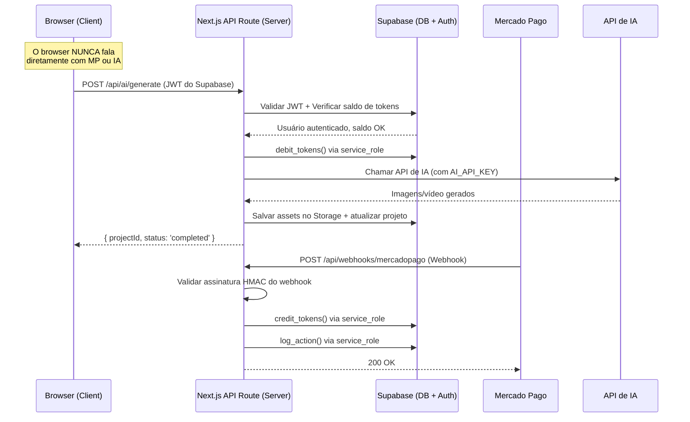

# Segurança - InfHub (Auditoria e Hardening)

Este documento é uma análise de segurança completa da modelagem de dados e da arquitetura do InfHub. Define as regras de proteção, sistema de logs, blindagem de APIs e garantias de que **toda operação sensível é 100% server-side**.

---

## 🔴 Auditoria da Modelagem Atual (Vulnerabilidades Encontradas)

### VULN-01: `token_balance` manipulável pelo client

> [!CAUTION]
> A tabela `profiles` tem `token_balance` como coluna editável. A policy RLS atual permite `UPDATE` livre no perfil. Um usuário malicioso poderia enviar um `UPDATE profiles SET token_balance = 999999 WHERE id = auth.uid()` diretamente pelo client do Supabase.

**Correção:** Remover `token_balance` da lista de colunas editáveis pelo usuário. Apenas as functions `debit_tokens` e `credit_tokens` (que rodam como `SECURITY DEFINER`) devem alterar o saldo.

```sql
-- Substituir a policy genérica por uma restritiva
DROP POLICY IF EXISTS "Users can update own profile" ON public.profiles;

CREATE POLICY "Users can update own profile (safe columns only)"
  ON public.profiles FOR UPDATE
  USING (auth.uid() = id)
  WITH CHECK (auth.uid() = id);

-- Criar uma view segura para o update do perfil (expõe apenas campos editáveis)
CREATE OR REPLACE FUNCTION public.update_my_profile(
  p_full_name TEXT DEFAULT NULL,
  p_avatar_url TEXT DEFAULT NULL,
  p_instagram_handle TEXT DEFAULT NULL
)
RETURNS void AS $$
BEGIN
  UPDATE public.profiles SET
    full_name = COALESCE(p_full_name, full_name),
    avatar_url = COALESCE(p_avatar_url, avatar_url),
    instagram_handle = COALESCE(p_instagram_handle, instagram_handle)
  WHERE id = auth.uid();
END;
$$ LANGUAGE plpgsql SECURITY DEFINER;

-- Revogar UPDATE direto da tabela profiles para o papel anon/authenticated
REVOKE UPDATE ON public.profiles FROM authenticated;
-- O update agora só acontece via a function acima
```

---

### VULN-02: `transactions` e `token_ledger` sem proteção contra INSERT client-side

> [!CAUTION]
> Mesmo com RLS restringindo SELECT, não há proteção contra INSERT. Um atacante poderia inserir transações falsas com `status = 'approved'` e `tokens_granted = 999` diretamente.

**Correção:** Essas tabelas devem ser **somente leitura** para o client. Apenas o servidor (via `service_role` key nos webhooks do Mercado Pago) pode inserir/atualizar.

```sql
-- transactions: apenas leitura para o usuário
REVOKE INSERT, UPDATE, DELETE ON public.transactions FROM authenticated;
REVOKE INSERT, UPDATE, DELETE ON public.transactions FROM anon;

-- token_ledger: apenas leitura para o usuário
REVOKE INSERT, UPDATE, DELETE ON public.token_ledger FROM authenticated;
REVOKE INSERT, UPDATE, DELETE ON public.token_ledger FROM anon;

-- subscriptions: apenas leitura para o usuário
REVOKE INSERT, UPDATE, DELETE ON public.subscriptions FROM authenticated;
REVOKE INSERT, UPDATE, DELETE ON public.subscriptions FROM anon;
```

---

### VULN-03: `ai_projects` permite INSERT com `tokens_cost = 0`

> [!WARNING]
> A policy atual permite que o usuário crie um `ai_project` com `tokens_cost = 0`, efetivamente usando o serviço de IA sem pagar tokens.

**Correção:** A criação de projetos de IA deve ser uma **server function** que valida o custo e debita tokens atomicamente.

```sql
CREATE OR REPLACE FUNCTION public.create_ai_project(
  p_product_image_url TEXT,
  p_model_image_url TEXT DEFAULT NULL,
  p_selected_model_id TEXT DEFAULT NULL,
  p_prompt TEXT DEFAULT NULL
)
RETURNS UUID AS $$
DECLARE
  v_project_id UUID;
  v_cost INTEGER := 10;  -- Custo fixo ou calculado por tipo
BEGIN
  -- Debitar tokens PRIMEIRO (falha se saldo insuficiente)
  PERFORM public.debit_tokens(
    auth.uid(), v_cost, 'ai_project', NULL,
    'Geração de conteúdo IA - TikTok Shop'
  );

  -- Criar o projeto somente após débito bem-sucedido
  INSERT INTO public.ai_projects (
    id, user_id, status, tokens_cost,
    product_image_url, model_image_url, selected_model_id, prompt
  ) VALUES (
    gen_random_uuid(), auth.uid(), 'pending', v_cost,
    p_product_image_url, p_model_image_url, p_selected_model_id, p_prompt
  ) RETURNING id INTO v_project_id;

  RETURN v_project_id;
END;
$$ LANGUAGE plpgsql SECURITY DEFINER;

-- Revogar INSERT direto
REVOKE INSERT ON public.ai_projects FROM authenticated;
```

---

### VULN-04: `debit_tokens` e `credit_tokens` invocáveis pelo client

> [!CAUTION]
> Functions com `SECURITY DEFINER` podem ser chamadas diretamente pelo client Supabase via `rpc()`. Um usuário poderia chamar `credit_tokens(auth.uid(), 99999, 'bonus')` e creditar tokens infinitos.

**Correção:** Restringir a execução dessas functions ao role `service_role` (backend) e criar wrappers controlados para o que o client precisa.

```sql
-- Revogar execução pública das functions financeiras
REVOKE EXECUTE ON FUNCTION public.credit_tokens FROM authenticated;
REVOKE EXECUTE ON FUNCTION public.credit_tokens FROM anon;
REVOKE EXECUTE ON FUNCTION public.debit_tokens FROM authenticated;
REVOKE EXECUTE ON FUNCTION public.debit_tokens FROM anon;

-- debit_tokens só será chamada indiretamente via create_ai_project ou export_carousel
-- credit_tokens só será chamada pelo webhook do Mercado Pago (service_role)
```

---

### VULN-05: Storage sem policies RLS

> [!WARNING]
> Os buckets foram criados mas sem políticas de acesso. Qualquer usuário autenticado poderia ler/escrever nos arquivos de outros usuários.

**Correção:**

```sql
-- ========== ai-assets (privado, por usuário) ==========
CREATE POLICY "Users can upload own AI assets"
  ON storage.objects FOR INSERT
  WITH CHECK (
    bucket_id = 'ai-assets'
    AND (storage.foldername(name))[1] = auth.uid()::text
  );

CREATE POLICY "Users can view own AI assets"
  ON storage.objects FOR SELECT
  USING (
    bucket_id = 'ai-assets'
    AND (storage.foldername(name))[1] = auth.uid()::text
  );

CREATE POLICY "Users can delete own AI assets"
  ON storage.objects FOR DELETE
  USING (
    bucket_id = 'ai-assets'
    AND (storage.foldername(name))[1] = auth.uid()::text
  );

-- ========== carousel-assets (privado, por usuário) ==========
CREATE POLICY "Users can upload own carousel assets"
  ON storage.objects FOR INSERT
  WITH CHECK (
    bucket_id = 'carousel-assets'
    AND (storage.foldername(name))[1] = auth.uid()::text
  );

CREATE POLICY "Users can view own carousel assets"
  ON storage.objects FOR SELECT
  USING (
    bucket_id = 'carousel-assets'
    AND (storage.foldername(name))[1] = auth.uid()::text
  );

CREATE POLICY "Users can delete own carousel assets"
  ON storage.objects FOR DELETE
  USING (
    bucket_id = 'carousel-assets'
    AND (storage.foldername(name))[1] = auth.uid()::text
  );

-- ========== exports (privado, por usuário) ==========
CREATE POLICY "Users can view own exports"
  ON storage.objects FOR SELECT
  USING (
    bucket_id = 'exports'
    AND (storage.foldername(name))[1] = auth.uid()::text
  );

-- ========== avatars (público para leitura, escrita própria) ==========
CREATE POLICY "Anyone can view avatars"
  ON storage.objects FOR SELECT
  USING (bucket_id = 'avatars');

CREATE POLICY "Users can upload own avatar"
  ON storage.objects FOR INSERT
  WITH CHECK (
    bucket_id = 'avatars'
    AND name = auth.uid()::text || '.jpg'
  );

-- ========== template-previews (somente leitura pública) ==========
CREATE POLICY "Anyone can view template previews"
  ON storage.objects FOR SELECT
  USING (bucket_id = 'template-previews');
-- Upload de previews: somente via service_role (admin)
```

---

## 📋 Sistema de Logs de Ações do Usuário

### Tabela `audit_logs`

Registro imutável de toda ação relevante do usuário na plataforma.

```sql
CREATE TYPE audit_action AS ENUM (
  -- Auth
  'auth.login',
  'auth.logout',
  'auth.register',
  'auth.password_reset',
  
  -- Profile
  'profile.update',
  
  -- Carrossel
  'carousel.create',
  'carousel.update',
  'carousel.delete',
  'carousel.export',
  'carousel.ai_generate',
  
  -- Slides
  'slide.create',
  'slide.update',
  'slide.delete',
  'slide.ai_refine',
  'slide.ai_generate_image',
  
  -- IA (Produto 1)
  'ai_project.create',
  'ai_project.download',
  
  -- Financeiro
  'subscription.create',
  'subscription.cancel',
  'transaction.payment_received',
  'tokens.purchase',
  'tokens.debit',
  'tokens.credit',
  
  -- Segurança
  'security.suspicious_activity',
  'security.rate_limit_hit',
  'security.unauthorized_attempt'
);

CREATE TABLE public.audit_logs (
  id              UUID PRIMARY KEY DEFAULT gen_random_uuid(),
  user_id         UUID REFERENCES public.profiles(id) ON DELETE SET NULL,
  action          audit_action NOT NULL,
  resource_type   TEXT,                  -- Ex: 'carousel', 'ai_project', 'subscription'
  resource_id     UUID,                  -- ID do recurso afetado
  ip_address      INET,                  -- IP do request
  user_agent      TEXT,                  -- Browser/client info
  metadata        JSONB DEFAULT '{}',    -- Dados extras contextuais
  created_at      TIMESTAMPTZ NOT NULL DEFAULT now()
);

-- Índices para consultas rápidas
CREATE INDEX idx_audit_user ON public.audit_logs(user_id);
CREATE INDEX idx_audit_action ON public.audit_logs(action);
CREATE INDEX idx_audit_created ON public.audit_logs(created_at DESC);
CREATE INDEX idx_audit_resource ON public.audit_logs(resource_type, resource_id);

-- RLS: usuários NÃO podem ler logs (somente admin via service_role)
ALTER TABLE public.audit_logs ENABLE ROW LEVEL SECURITY;
-- Sem policies = nenhum acesso pelo client. Somente service_role.
```

### Function para registrar logs (chamada pelas outras functions)

```sql
CREATE OR REPLACE FUNCTION public.log_action(
  p_user_id UUID,
  p_action audit_action,
  p_resource_type TEXT DEFAULT NULL,
  p_resource_id UUID DEFAULT NULL,
  p_ip_address INET DEFAULT NULL,
  p_user_agent TEXT DEFAULT NULL,
  p_metadata JSONB DEFAULT '{}'
)
RETURNS void AS $$
BEGIN
  INSERT INTO public.audit_logs (
    user_id, action, resource_type, resource_id,
    ip_address, user_agent, metadata
  ) VALUES (
    p_user_id, p_action, p_resource_type, p_resource_id,
    p_ip_address, p_user_agent, p_metadata
  );
END;
$$ LANGUAGE plpgsql SECURITY DEFINER;

-- Somente service_role pode chamar
REVOKE EXECUTE ON FUNCTION public.log_action FROM authenticated;
REVOKE EXECUTE ON FUNCTION public.log_action FROM anon;
```

---

## 🛡️ Arquitetura Server-Side (Zero Trust no Client)

### Princípio Fundamental

> [!IMPORTANT]
> **NENHUMA chave de API, secret ou lógica de negócio sensível deve existir no frontend.**
> O client (Next.js browser) só conhece a `SUPABASE_URL` e a `SUPABASE_ANON_KEY` (chave pública).
> Toda operação que envolva dinheiro, tokens ou APIs externas passa obrigatoriamente pelo servidor.

### Variáveis de Ambiente (`.env.local`)

```env
# ===== PÚBLICAS (expostas ao browser via NEXT_PUBLIC_) =====
NEXT_PUBLIC_SUPABASE_URL=https://xxxxx.supabase.co
NEXT_PUBLIC_SUPABASE_ANON_KEY=eyJhbGciOiJIUzI1NiIs...

# ===== PRIVADAS (NUNCA expostas ao browser) =====
SUPABASE_SERVICE_ROLE_KEY=eyJhbGciOiJIUzI1NiIs...   # Acesso total ao DB
MERCADO_PAGO_ACCESS_TOKEN=APP_USR-xxxxx              # Token do Mercado Pago
MERCADO_PAGO_WEBHOOK_SECRET=xxxxx                    # Secret para validar webhooks
AI_API_KEY=xxxxx                                      # Chave da API de IA (Gemini/OpenAI)
```

### Fluxo de Chamadas (Diagrama)



---

## 🔐 API Routes Seguras (Next.js Server-Side)

### Estrutura de pastas das rotas de API

```text
src/app/api/
  ├── webhooks/
  │   └── mercadopago/
  │       └── route.ts          # Webhook do Mercado Pago (validação HMAC)
  ├── ai/
  │   ├── generate/
  │   │   └── route.ts          # Criação de projeto IA (débito + chamada API)
  │   └── generate-image/
  │       └── route.ts          # Geração de imagem avulsa para slide
  ├── carousel/
  │   └── export/
  │       └── route.ts          # Exportação do carrossel (débito de tokens)
  ├── subscription/
  │   ├── create/
  │   │   └── route.ts          # Criar assinatura no Mercado Pago
  │   └── cancel/
  │       └── route.ts          # Cancelar assinatura
  └── tokens/
      └── purchase/
          └── route.ts          # Compra avulsa de tokens (cria link de pagamento)
```

### Middleware de Autenticação (padrão para todas as API routes)

```typescript
// src/lib/api-auth.ts
import { createClient } from '@supabase/supabase-js'
import { NextRequest, NextResponse } from 'next/server'

export async function authenticateRequest(req: NextRequest) {
  const authHeader = req.headers.get('Authorization')
  
  if (!authHeader?.startsWith('Bearer ')) {
    return { error: NextResponse.json(
      { error: 'Token de autenticação ausente' }, 
      { status: 401 }
    )}
  }

  const token = authHeader.replace('Bearer ', '')
  
  // Usar a ANON KEY para validar o JWT do usuário
  const supabase = createClient(
    process.env.NEXT_PUBLIC_SUPABASE_URL!,
    process.env.NEXT_PUBLIC_SUPABASE_ANON_KEY!
  )
  
  const { data: { user }, error } = await supabase.auth.getUser(token)
  
  if (error || !user) {
    return { error: NextResponse.json(
      { error: 'Token inválido ou expirado' }, 
      { status: 401 }
    )}
  }

  return { user }
}

// Client com service_role (para operações privilegiadas)
export function getServiceClient() {
  return createClient(
    process.env.NEXT_PUBLIC_SUPABASE_URL!,
    process.env.SUPABASE_SERVICE_ROLE_KEY!
  )
}
```

---

## 🧱 Webhook do Mercado Pago (Validação HMAC)

> [!CAUTION]
> O endpoint de webhook é público. Sem validação HMAC, qualquer pessoa poderia enviar um POST falso e creditar tokens infinitos.

```typescript
// src/app/api/webhooks/mercadopago/route.ts
import { NextRequest, NextResponse } from 'next/server'
import crypto from 'crypto'
import { getServiceClient } from '@/lib/api-auth'

export async function POST(req: NextRequest) {
  // 1. Validar assinatura HMAC do Mercado Pago
  const xSignature = req.headers.get('x-signature')
  const xRequestId = req.headers.get('x-request-id')
  
  if (!xSignature || !xRequestId) {
    return NextResponse.json({ error: 'Missing headers' }, { status: 400 })
  }

  const body = await req.text()
  const url = new URL(req.url)
  const dataId = url.searchParams.get('data.id')
  
  // Montar o manifest conforme docs do Mercado Pago
  const manifest = `id:${dataId};request-id:${xRequestId};ts:${
    xSignature.split(',').find(p => p.startsWith('ts='))?.split('=')[1]
  };`
  
  const hmac = crypto
    .createHmac('sha256', process.env.MERCADO_PAGO_WEBHOOK_SECRET!)
    .update(manifest)
    .digest('hex')

  const receivedHash = xSignature
    .split(',')
    .find(p => p.startsWith('v1='))
    ?.split('=')[1]

  if (hmac !== receivedHash) {
    // LOG: Tentativa de webhook falsificado
    const supabase = getServiceClient()
    await supabase.rpc('log_action', {
      p_user_id: null,
      p_action: 'security.suspicious_activity',
      p_metadata: { reason: 'Invalid HMAC on webhook', ip: req.ip }
    })
    return NextResponse.json({ error: 'Invalid signature' }, { status: 403 })
  }

  // 2. Processar o webhook (creditar tokens, atualizar subscription, etc.)
  // ... lógica de negócio usando service_role
  
  return NextResponse.json({ received: true }, { status: 200 })
}
```

---

## 🚦 Rate Limiting e Proteção contra Abuso

### Limites por Endpoint

| Endpoint | Limite | Janela | Ação ao exceder |
|----------|--------|--------|-----------------|
| `/api/ai/generate` | 5 requests | 1 minuto | 429 + log |
| `/api/ai/generate-image` | 10 requests | 1 minuto | 429 + log |
| `/api/carousel/export` | 20 requests | 1 minuto | 429 + log |
| `/api/tokens/purchase` | 3 requests | 5 minutos | 429 + log |
| `/api/webhooks/mercadopago` | 50 requests | 1 minuto | 429 + log |
| Auth (login/register) | 5 tentativas | 15 minutos | Bloqueio temporário |

### Implementação com `upstash/ratelimit`

```typescript
// src/lib/rate-limit.ts
import { Ratelimit } from '@upstash/ratelimit'
import { Redis } from '@upstash/redis'

const redis = new Redis({
  url: process.env.UPSTASH_REDIS_URL!,
  token: process.env.UPSTASH_REDIS_TOKEN!,
})

export const rateLimiters = {
  aiGenerate: new Ratelimit({
    redis,
    limiter: Ratelimit.slidingWindow(5, '1m'),
    prefix: 'rl:ai:gen',
  }),
  imageGenerate: new Ratelimit({
    redis,
    limiter: Ratelimit.slidingWindow(10, '1m'),
    prefix: 'rl:ai:img',
  }),
  export: new Ratelimit({
    redis,
    limiter: Ratelimit.slidingWindow(20, '1m'),
    prefix: 'rl:export',
  }),
  purchase: new Ratelimit({
    redis,
    limiter: Ratelimit.slidingWindow(3, '5m'),
    prefix: 'rl:purchase',
  }),
}
```

---

## 🔏 Checklist de Segurança Final

### Banco de Dados (Supabase)
- [x] RLS habilitado em **todas** as tabelas
- [x] `token_balance` protegido contra UPDATE direto (via REVOKE + function)
- [x] `transactions`, `token_ledger`, `subscriptions` são **somente leitura** para o client
- [x] `credit_tokens` e `debit_tokens` inacessíveis pelo client (REVOKE EXECUTE)
- [x] `audit_logs` invisível para o client (sem policies de SELECT)
- [x] Storage com policies RLS por `user_id` em todos os buckets privados
- [x] `ai_projects` criados apenas via server function com débito atômico

### API Routes (Next.js)
- [x] Toda rota valida JWT do Supabase antes de processar
- [x] `service_role_key` **nunca** exposta ao browser
- [x] Chaves de API externas (Mercado Pago, IA) **nunca** expostas ao browser
- [x] Webhook do Mercado Pago validado via HMAC-SHA256
- [x] Rate limiting em todos os endpoints sensíveis
- [x] Logs de segurança para tentativas suspeitas

### Frontend (Client)
- [x] Apenas `NEXT_PUBLIC_SUPABASE_URL` e `NEXT_PUBLIC_SUPABASE_ANON_KEY` acessíveis
- [x] Nenhuma chamada direta do browser para Mercado Pago ou APIs de IA
- [x] Tokens JWT enviados via header `Authorization: Bearer` (não via cookie inseguro)
- [x] Inputs sanitizados antes de envio ao servidor

### Logs e Auditoria
- [x] Toda ação financeira gera entrada no `audit_logs`
- [x] Toda ação de IA gera entrada no `audit_logs`
- [x] Tentativas de acesso não autorizado são logadas
- [x] Rate limit hits são logados com IP e user_agent
- [x] Logs são imutáveis (sem UPDATE/DELETE para authenticated)
